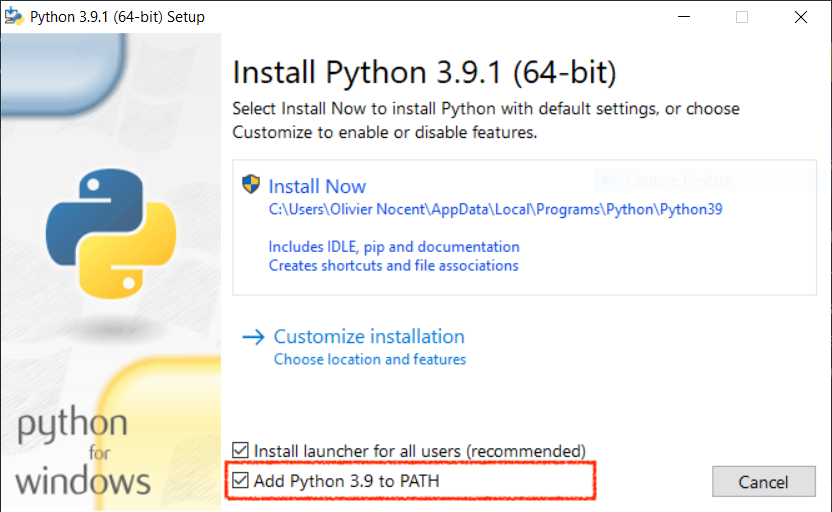

# Une approche basée exemple pour les sciences du sport

 Ce cours n'a pas l'ambition de présenter le langage Python de manière exhaustive :
 tâche titanesque au demeurant. J'ai plutôt privilégié une approche guidée par des
 exemples familiers à des étudiants en sciences du sport : ???, ???,
 tracé de parcours de course sur une carte à partir de coordonnées GPS, etc.

Chaque exemple est prétexte à aborder des notions centrales en programmation (variables,
tests, boucles) et à présenter des bibliothèques intéressantes qui viennent enrichir le
langage Python. Si vous êtes novice en programmation, je vous encourage à étudier chaque
chapitre dans l'ordre pour vous familiariser progressivement à cette nouvelle connaissance.
Par contre, si vous êtes un développeur déjà expérimenté, vous pouvez papillonner de
chapitres en chapitres pour découvrir des modules comme `polars`, `plotly`, `beautifulsoup4`,
`folium`, `requests` ou `opencv`. 

## Installation

L'exécution de scripts Python nécessite l'utilisation d'un interprète, logiciel qui traduit
chaque instruction du script en code machine compréhensible par le microprocesseur. Il est
disponible pour les plateformes les plus courantes (Windows, macOS, Linux, Raspberry Pi).
Tous les exemples de ce cours sont écrits en Python 3. 

[Python3 :material-download:](https://www.python.org/){ .md-button .md-button--primary }

!!! warning "Attention !"
    
    Lorsque vous installez Python sous Windows, n'oubliez pas d'ajouter l'emplacement de
    l'interprète Python à la variable d'environnement `PATH` en cochant la case surlignée
    ci-dessous. 

    { loading=lazy }

* `mkdocs new [dir-name]` - Create a new project.
* `mkdocs serve` - Start the live-reloading docs server.
* `mkdocs build` - Build the documentation site.
* `mkdocs -h` - Print help message and exit.

## Project layout

    mkdocs.yml    # The configuration file.
    docs/
        index.md  # The documentation homepage.
        ...       # Other markdown pages, images and other files.
