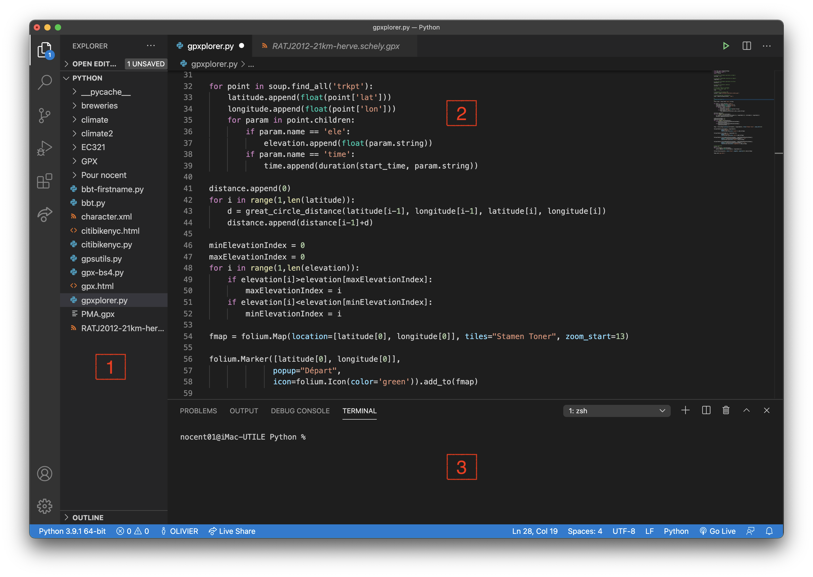

# Une approche basée exemple pour les sciences du sport

 Ce cours n'a pas l'ambition de présenter le langage Python de manière exhaustive :
 tâche titanesque au demeurant. J'ai plutôt privilégié une approche guidée par des
 exemples familiers à des étudiants en sciences du sport : ???, ???,
 tracé de parcours de course sur une carte à partir de coordonnées GPS, etc.

Chaque exemple est prétexte à aborder des notions centrales en programmation (variables,
tests, boucles) et à présenter des bibliothèques intéressantes qui viennent enrichir le
langage Python. Si vous êtes novice en programmation, je vous encourage à étudier chaque
chapitre dans l'ordre pour vous familiariser progressivement à cette nouvelle connaissance.
Par contre, si vous êtes un développeur déjà expérimenté, vous pouvez papillonner de
chapitres en chapitres pour découvrir des modules comme `polars`, `plotly`, `beautifulsoup4`,
`folium`, `requests` ou `opencv`. 

## Installation de Python

L'exécution de scripts Python nécessite l'utilisation d'un interprète, logiciel qui traduit
chaque instruction du script en code machine compréhensible par le microprocesseur. Il est
disponible pour les plateformes les plus courantes (Windows, macOS, Linux, Raspberry Pi).
Tous les exemples de ce cours sont écrits en Python 3. 

[Python 3 :material-download:](https://www.python.org/){ .md-button .md-button--primary }

!!! warning "Attention !"
    
    Lorsque vous installez Python sous Windows, n'oubliez pas d'ajouter l'emplacement de
    l'interprète Python à la variable d'environnement `PATH` en cochant la case surlignée
    ci-dessous. 

    { loading=lazy }

## Démarrage de *IDLE*

IDLE est l'environnement de développement par défaut de Python 3. Il comprend :

Un interprète en ligne de commande (shell)
: pour effectuer des calculs ou exécuter des programmes simples 
Un éditeur de code
: pour rédiger des scripts plus complexes qui pourront ensuite être exécutés dans le shell Python 

L'interprète en ligne de commande ressemble à une calculatrice avancée. À droite de l'invite
de comnande (`>>>`), on peut saisir des instructions simples qui sont directement exécutées
dès que l'on appuie sur la touche ++Entrée++.

Pour aller plus loin et automatiser des traitements plus complexes, nous aurons recours à des
scripts, fichiers texte contenant une succession d'instructions Python. On crée un nouveau script
via le menu ++File++ / ++New File++. En règle générale, un script Python a pour extension `.py`.
Enfin, on exécute le script Python dans le shell de IDLE via le menu ++Run++ / ++Run Module++
(touche de raccourci ++F5++).

Pas de panique, nous aurons l'occasion de manipuler l'interprète en ligne de commande et de nous
familiariser progressivement avec l'éditeur de scripts au fil des chapitres suivants. 

## Choix d'un autre éditeur de code

Pour remplacer IDLE lors de l'édition de vos scripts Python, vous n'aurez besoin que d'un
simple éditeur de texte comme le bloc notes de Windows. Néanmoins, je vous encourage à utiliser
un éditeur un peu plus sophistiqué qui propose :

- un navigateur de fichiers
- un système d'onglets pour l'édition simultanée de plusieurs fichiers
- la coloration syntaxique afin de mettre en évidence les mots-clés du langage
- un terminal pour l'exécution des scripts

Vous avez dorénavant le choix entre un grand nombre d'éditeurs de code source compatible avec Python.
Voici quelques suggestions :

- [Visual Studio Code](https://code.visualstudio.com/) code editing redefined by Microsoft
- [PyCharm](https://www.jetbrains.com/fr-fr/pycharm/) l'IDE Python pour les développeurs professionnels de JetBrains
- [Spyder](https://www.spyder-ide.org/) The Scientific Python Development Environment

<figure>
  
  <figcaption>Aperçu de l'interface de Visual Studio Code : [1] navigateur de fichiers, [2] éditeur de code, [3] terminal intégré</figcaption>
</figure>

!!! tip "Astuce"
    
    En installant l'extension Python pour Visual Studio Code, vous pouvez enrichir l'interface de
    l'éditeur avec un bouton :material-play: pour éxécuter un script afin de visualiser son résultat
    dans le terminal intégré. 

## Installation de modules

La force de Python réside dans les modules, apportant de nouvelles fonctionnalités qui enrichissent
le langage de base. A chaque thème, correspond un module : `polars` pour la manipulation de données
tabulaires, `plotly` pour la génération de graphiques, ...

L'outil PIP permet de télécharger et d'installer un module. Dans un terminal (ou une invite de commandes
sous Windows), vous devez taper la commande suivante :

Windows :

```
pip.exe install [module]
```

macOS ou Linux :

```
pip3 install [module]
```

`[module]` doit être remplacé par le nom du module à installer. 

!!! warning "Attention !"

    Cette commande doit être exécutée en mode administrateur. Sous Windows, dans le menu Démarrer,
    clic droit sur l'application "invite de commandes" et choisir "exécuter en tant qu'administrateur".

    Si vous ne disposez pas des droits administrateur, vous pouvez ajouter l'option `--user` à la fin
    de la commande pour installer le module dans votre compte utilisateur.

Nous utiliserons plusieurs modules au fil des chapitres de ce cours. Je vous encourage à installer dès
maintenant tous les modules nécessaires à l'aide de la commande suivante :

Windows :

```
pip.exe install numpy polars openpyxl xlrd2 plotly lxml beautifulsoup4 folium requests
```

macOS ou Linux :

```
pip3 install numpy polars openpyxl xlrd2 plotly lxml beautifulsoup4 folium requests
```

Maintenant que votre environnement de développement est configuré, il est temps de découvrir pas à pas
les spécificités du langage Python. 